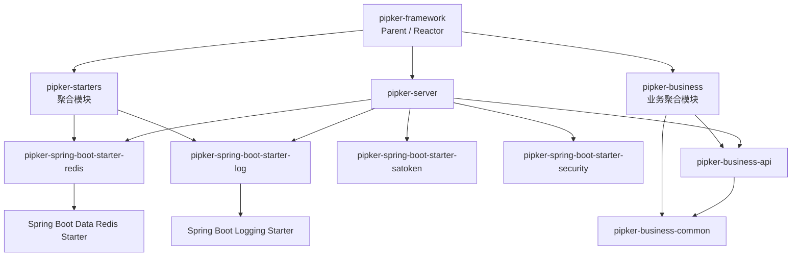

# Pipker Framework Backend

Pipker Framework 的 Maven 后端工程。该工程以 **Starter 技术基础设施 + 业务模块 + Server 组装模块** 划分职责，所有模块继承根 POM 统一管理的 Spring Boot `4.1.1`、Java `21` 和内部模块版本。

## 模块结构

```text
backend/
├── pom.xml                                      # 根 Parent / Reactor
├── pipker-starters/                              # Starter 聚合模块（pom）
│   ├── pom.xml
│   ├── pipker-spring-boot-starter-redis/        # Redis 技术基础设施 Starter
│   ├── pipker-spring-boot-starter-log/          # 技术日志 Starter
│   ├── pipker-spring-boot-starter-satoken/      # Sa-Token 鉴权与会话 Starter
│   └── pipker-spring-boot-starter-security/     # 密码哈希与字段加密 Starter
├── pipker-business/                              # 业务聚合模块（pom）
│   ├── pipker-business-common/                   # 公共业务能力模块
│   └── pipker-business-api/                      # 单独业务能力模块
└── pipker-server/                                # 可执行 Spring Boot Server
```

## 模块职责

| 模块 | Maven 坐标 | 打包类型 | 职责 |
| --- | --- | --- | --- |
| `pipker-framework` | `com.pipker:pipker-framework` | `pom` | 根 Parent 与 Maven Reactor；统一管理 Spring Boot、Java、编码和内部模块版本。 |
| `pipker-starters` | `com.pipker:pipker-starters` | `pom` | 聚合 Pipker 的技术 Starter，仅参与 Reactor 构建，不产出业务 Jar。 |
| `pipker-spring-boot-starter-redis` | `com.pipker:pipker-spring-boot-starter-redis` | `jar` | Redis 技术基础设施边界；当前依赖 Spring Boot 官方 `spring-boot-starter-data-redis`，由 Spring Boot 提供 Redis 自动配置。 |
| `pipker-spring-boot-starter-log` | `com.pipker:pipker-spring-boot-starter-log` | `jar` | 统一日志基础设施；提供 TraceId/MDC、条件化 HTTP 与慢请求日志、操作日志、脱敏、异常日志与低耦合扩展 SPI，不重新包装 SLF4J API。 |
| `pipker-spring-boot-starter-satoken` | `com.pipker:pipker-spring-boot-starter-satoken` | `jar` | 基于 Sa-Token `1.46.0` 的基础鉴权能力；提供 Bearer Token、统一登录会话门面、全局 API 过滤和内存/Redis DAO 切换。 |
| `pipker-spring-boot-starter-security` | `com.pipker:pipker-spring-boot-starter-security` | `jar` | 密码哈希与字段加解密边界；以配置选择 BCrypt/PBKDF2 与 AES-GCM/RSA-OAEP 的活动算法，对业务只暴露一个安全服务。 |
| `pipker-business` | `com.pipker:pipker-business` | `pom` | 聚合公共业务模块和单独业务模块，仅参与 Reactor 构建，不产出业务 Jar。 |
| `pipker-business-common` | `com.pipker:pipker-business-common` | `jar` | 公共业务能力边界，供单独业务模块复用；当前包含与 Sa-Token 解耦的 `LoginType`、`LoginIdentity` 身份契约，不依赖 Server、技术 Starter 或单独业务模块。 |
| `pipker-business-api` | `com.pipker:pipker-business-api` | `jar` | 单独业务能力边界，当前由 Server 组装，并依赖公共业务模块。 |
| `pipker-server` | `com.pipker:pipker-server` | `jar` | 可执行 HTTP Server；组合单独业务模块、Redis Starter、Log Starter，以及当前直接使用的 Web 与 Validation Starter。 |

## 模块关系



依赖方向约束：

- `pipker-server` 依赖 `pipker-business-api` 和技术 Starter。
- `pipker-business-api` 可以依赖 `pipker-business-common`。
- `pipker-business-common` 不依赖单独业务模块或 `pipker-server`。
- 技术 Starter 不依赖 `pipker-business` 或 `pipker-server`。
- 业务模块不依赖 `pipker-server`。
- `pipker-starters` 只负责聚合，不作为 Server 的运行时依赖。

## 当前 Starter 边界

### Redis Starter

`pipker-spring-boot-starter-redis` 当前仅建立 Redis 基础依赖与 Spring Boot 自动配置能力，不包含：

- Redisson
- 分布式锁、限流或缓存业务
- `RedisRepository`
- 自定义 `RedisTemplate` 或序列化策略

后续如确有需求，可在包 `com.pipker.starter.redis` 中扩展 Redis 基础设施实现。

### Log Starter

`pipker-spring-boot-starter-log` 是统一日志基础设施 Starter。业务代码继续直接使用 SLF4J：

```java
@Slf4j
public class UserService {

    public void create() {
        log.info("User created");
    }
}
```

Starter 不新增 `LogUtils.info()`、`LogUtils.error()` 或自定义 Logger 门面。它提供的能力如下：

| 能力 | 默认状态 | 说明 |
| --- | --- | --- |
| TraceId / MDC | 开启 | 复用合法上游 `X-Trace-Id` 或生成新值；维护 `traceId`、`requestId`、`serviceName`、`clientIp`、`httpMethod`、`requestUri`。 |
| TraceId 响应 Header | 开启 | 将本次 TraceId 回写到 `X-Trace-Id`。 |
| 单条 HTTP 请求日志 | 关闭 | 避免引入 Starter 后产生大量访问日志；启用后输出 `[HTTP]`。 |
| 慢请求日志 | 开启 | 默认阈值 `1000ms`，超过后输出 `[SLOW]` WARN。 |
| `@OperationLog` 操作日志 | 开启 | 只对显式标注的方法记录，不写数据库；默认参数和返回值不记录。 |
| 敏感信息脱敏 | 开启 | 默认屏蔽密码、令牌、Cookie、手机号、邮箱、身份证号、银行卡号等。 |
| MVC 异常日志 | 开启 | 仅观察异常、保留完整栈，不创建或替换全局异常处理器。 |
| 请求 Header / 请求 Body / 响应 Body | 关闭 | 需明确开启；仅允许 JSON 文本、受长度上限保护并且统一脱敏。 |

#### 完整配置示例

下列示例展示全部主要配置项；没有必要时可只保留需要覆盖默认值的部分。

```yaml
pipker:
  log:
    enabled: true
    context:
      # 未设置时采用 spring.application.name；仍未设置时为 application。
      service-name: pipker-server
      request-id-enabled: true
      client-ip-enabled: true
    trace:
      enabled: true
      header-name: X-Trace-Id
      accept-upstream: true
      write-response-header: true
    request:
      # 轻量默认：逐条请求日志关闭；慢请求仍会记录。
      enabled: false
      level: info
      include-parameters: false
      include-headers: false
      include-request-body: false
      include-response-body: false
      # 单位为字节；请求和响应日志副本都受此限制。
      max-body-length: 4096
      # 用于与已有 Filter 协调；默认 Ordered.HIGHEST_PRECEDENCE + 10。
      filter-order: -2147483638
      ignored-paths:
        - /actuator/**
        - /error
        - /favicon.ico
      ignored-content-types:
        - multipart/*
        - application/octet-stream
        - image/*
      body-content-types:
        - application/json
        - application/*+json
    slow-request:
      enabled: true
      threshold: 1000
      level: warn
    operation:
      enabled: true
      level: info
      record-parameters: false
      record-result: false
      max-value-length: 4096
    sensitive:
      enabled: true
      mask-text: "******"
      # 在默认字段集合外追加需要脱敏的字段名和类型。
      additional-fields:
        apiSecret: token
        employeeEmail: email
    exception:
      enabled: true
      max-message-length: 1024
```

`ignored-paths` 同时作用于普通请求日志和慢请求日志。TraceId/MDC 仍会在这些请求中建立，保证诊断上下文一致。请求与响应 Body 只在 Content-Type 匹配 `body-content-types` 时记录；multipart、二进制、解析失败的 JSON 不会回退输出原始文本。

#### Logback 格式策略

Starter 不携带 `logback-spring.xml`、不创建日志目录，也不设定滚动或保留周期。应用拥有自己的日志输出策略；若希望控制台展示 TraceId，可在应用配置中加入：

```yaml
logging:
  pattern:
    console: "%d{yyyy-MM-dd HH:mm:ss.SSS} %-5level [%X{traceId}] [%X{requestId}] %logger{36} - %msg%n"
```

例如一次携带 `X-Trace-Id: upstream-123` 的请求执行上述业务代码，输出可为：

```text
2026-09-01 15:10:00.123 INFO  [upstream-123] [a5d3…] c.p.user.UserService - User created
```

#### 操作日志与脱敏示例

```java
import com.pipker.starter.log.annotation.OperationLog;
import com.pipker.starter.log.annotation.OperationLogRecordPolicy;
import com.pipker.starter.log.annotation.Sensitive;
import com.pipker.starter.log.sensitive.SensitiveType;

public record CreateUserCommand(
        String username,
        @Sensitive(SensitiveType.PHONE) String phone,
        @Sensitive String password
) {
}

@OperationLog(
        module = "用户管理",
        operation = "新增用户",
        recordParameters = OperationLogRecordPolicy.ENABLED
)
public UserView createUser(CreateUserCommand command) {
    // 正常业务逻辑；日志中 phone/password 已脱敏。
}
```

成功操作输出到独立 Logger `pipker.operation`，字段包含模块、操作名称、方法、请求路径、MDC 中可用的操作人/IP、脱敏参数、耗时和成功状态。失败操作仍会记录 `success=false`、异常类型和受限异常消息，原异常会按业务语义继续抛出。

#### 扩展边界与其他模块协作

当前日志 Starter 不依赖任何业务模块。以下能力均为可选协作，而非启动前置条件：

| 目标 | 协作模块 | 接入方式 |
| --- | --- | --- |
| `userId`、`username` MDC | Sa-Token 或未来 Auth Starter | 认证模块实现 `LogContextContributor`。当前 `AuthSessionService` 可提供用户 ID 和登录类型，但不含用户名契约。 |
| `tenantId` MDC | 未来 Tenant 模块 | Tenant 模块实现 `LogContextContributor`。 |
| 操作日志外部存储 | 使用方基础设施模块 | 提供唯一 `OperationLogHandler` Bean 以替换默认 SLF4J Handler。 |
| 全局异常处理集成 | 未来异常处理模块 | 在既有 Handler 中调用 `ExceptionLogReporter`，无需新建第二个 Advice。 |
| 异步 MDC 透传 | 使用方线程池模块 | 将 `MdcTaskDecorator` 组合到自行管理的 Executor；Starter 不接管全局线程池。 |
| Feign / RestClient / WebClient 透传 | 对应客户端模块 | 当前未实现；后续应以可选、条件化 Adapter 读取 MDC `traceId` 并写入已配置 Header。 |

第一阶段仅实现 Servlet/MVC 请求链路。Gateway、Feign、RestClient、WebClient 和自动接管异步线程池均留作后续按实际依赖引入的扩展，避免日志 Starter 反向耦合业务或网络客户端模块。

## Sa-Token 鉴权 Starter

Server 默认保护 `/api/**`。目前唯一已确认的匿名接口是 `GET /api/ping`；其他公开路由必须在 `pipker.security.auth.public-routes` 中以 `METHOD path` 的形式明确配置，例如未来登录接口可增加 `POST /api/auth/login`。默认策略不会自动创建账号、用户表、注册接口或登录 Controller。

未来业务在完成自身的账号凭证校验后，应注入 `AuthSessionService` 并调用 `login(LoginIdentity)` 创建会话。公共模块中的 `LoginType` 和 `LoginIdentity` 只描述可扩展的账号域与业务账号 ID，不预设用户、管理员或角色类型，也不依赖 Sa-Token。

令牌仅从 HTTP 请求头读取，约定如下：

```http
Authorization: Bearer <token>
```

请求体和 Cookie 中的令牌读取已关闭。未登录或无效令牌访问受保护接口时，服务返回 HTTP `401` 和 `application/problem+json`。默认会话策略为：最长 7 天、30 分钟无访问失效、同一账号允许多端独立登录。

### 内存与 Redis 会话存储

默认 `pipker.security.auth.session-store=memory`，适合单实例开发；进程重启后会话自然失效。启用 Redis 模式时设置 `SPRING_PROFILES_ACTIVE=redis`，`pipker-server` 会加载 `application-redis.yml`，并通过 Spring Boot 标准 `spring.data.redis.*` 配置创建 Redis DAO。

Redis profile 必须提供以下环境变量：

| 变量 | 说明 |
| --- | --- |
| `PIPKER_REDIS_HOST` | Redis 主机地址。 |
| `PIPKER_REDIS_PORT` | 可选，默认 `6379`。 |
| `PIPKER_REDIS_DATABASE` | 可选，默认 `0`。 |
| `PIPKER_REDIS_USERNAME` | 可选 Redis ACL 用户名。 |
| `PIPKER_REDIS_PASSWORD` | 可选 Redis 密码。 |

Redis 模式选中却缺少 Spring Data Redis 基础设施时，应用会在启动阶段失败；项目不会静默回退到内存会话，避免多实例部署误失去共享会话能力。

## Security 加密 Starter

`SecurityCryptoService` 是业务模块唯一需要注入的密码学入口：

- `hashPassword`、`matchesPassword`、`needsPasswordUpgrade` 处理密码。
- `encrypt`、`decrypt` 处理敏感字段。

调用方不传递算法名。配置分别选择一个密码哈希算法和一个字段加密算法：

| 能力 | 可选算法 | 默认配置 | 行为 |
| --- | --- | --- | --- |
| 密码哈希 | `bcrypt`、`pbkdf2-sha256` | `bcrypt` | 结果保留算法前缀；验证可识别受支持的旧格式，`needsPasswordUpgrade` 用于渐进升级。 |
| 字段加密 | `aes-gcm`、`rsa-oaep-sha256` | `aes-gcm` | 新写入数据只使用活动算法；密文保留版本与算法标识，切换字段算法前必须自行迁移历史数据。 |

AES 使用 `AES/GCM/NoPadding`、256 位 Base64 密钥、96 位随机 nonce 和 128 位认证标签。RSA 使用 `RSA/ECB/OAEPWithSHA-256AndMGF1Padding`，公钥必须为 Base64 X.509 DER，私钥必须为 Base64 PKCS#8 DER。RSA 适合较短的跨系统敏感值或密钥封装，不应直接加密大字段。

活动字段加密算法的密钥不允许存在开发默认值；密钥缺失、格式错误或长度不符都会阻止服务启动，且密钥不会写入日志。默认 AES-GCM 模式需要：

| 变量 | 说明 |
| --- | --- |
| `PIPKER_SECURITY_AES_GCM_KEY` | Base64 编码且解码后恰好为 32 字节的 AES 密钥。 |
| `PIPKER_SECURITY_RSA_OAEP_PUBLIC_KEY` | 仅在选择 `rsa-oaep-sha256` 时需要的 Base64 X.509 DER 公钥。 |
| `PIPKER_SECURITY_RSA_OAEP_PRIVATE_KEY` | 仅在选择 `rsa-oaep-sha256` 时需要的 Base64 PKCS#8 DER 私钥。 |

本地启动默认 AES-GCM 模式前，可在当前终端生成临时密钥：

```bash
export PIPKER_SECURITY_AES_GCM_KEY="$(openssl rand -base64 32)"
mvn -pl pipker-server -am spring-boot:run
```

该命令仅适合本地开发；生产密钥必须由部署环境的密钥管理或安全注入机制提供。

## 构建与测试

前置条件：JDK `21` 和 Maven `3.9+`。

在本目录执行：

```bash
mvn clean test
```

该命令会按 Reactor 顺序构建根项目、全部技术 Starter、Starter 聚合模块、业务模块与 Server 模块，并运行各模块测试。
