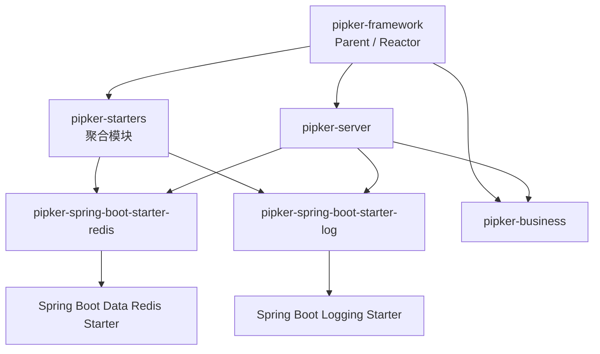

# Pipker Framework Backend

Pipker Framework 的 Maven 后端工程。该工程以 **Starter 技术基础设施 + 业务模块 + Server 组装模块** 划分职责，所有模块继承根 POM 统一管理的 Spring Boot `4.1.1`、Java `21` 和内部模块版本。

## 模块结构

```text
backend/
├── pom.xml                                      # 根 Parent / Reactor
├── pipker-starters/                              # Starter 聚合模块（pom）
│   ├── pom.xml
│   ├── pipker-spring-boot-starter-redis/        # Redis 技术基础设施 Starter
│   └── pipker-spring-boot-starter-log/          # 技术日志 Starter
├── pipker-business/                              # 项目业务能力模块
└── pipker-server/                                # 可执行 Spring Boot Server
```

## 模块职责

| 模块 | Maven 坐标 | 打包类型 | 职责 |
| --- | --- | --- | --- |
| `pipker-framework` | `com.pipker:pipker-framework` | `pom` | 根 Parent 与 Maven Reactor；统一管理 Spring Boot、Java、编码和内部模块版本。 |
| `pipker-starters` | `com.pipker:pipker-starters` | `pom` | 聚合 Pipker 的技术 Starter，仅参与 Reactor 构建，不产出业务 Jar。 |
| `pipker-spring-boot-starter-redis` | `com.pipker:pipker-spring-boot-starter-redis` | `jar` | Redis 技术基础设施边界；当前依赖 Spring Boot 官方 `spring-boot-starter-data-redis`，由 Spring Boot 提供 Redis 自动配置。 |
| `pipker-spring-boot-starter-log` | `com.pipker:pipker-spring-boot-starter-log` | `jar` | 技术日志基础设施边界；当前依赖 Spring Boot 官方 `spring-boot-starter-logging`，保留日志格式、MDC / TraceId、请求日志和日志脱敏的后续扩展位置。 |
| `pipker-business` | `com.pipker:pipker-business` | `jar` | 项目业务能力边界，承载后续应用业务代码。 |
| `pipker-server` | `com.pipker:pipker-server` | `jar` | 可执行 HTTP Server；组合业务模块、Redis Starter、Log Starter，以及当前直接使用的 Web 与 Validation Starter。 |

## 模块关系



依赖方向约束：

- `pipker-server` 可以依赖 `pipker-business` 和技术 Starter。
- 技术 Starter 不依赖 `pipker-business` 或 `pipker-server`。
- `pipker-business` 不依赖 `pipker-server`。
- `pipker-starters` 只负责聚合，不作为 Server 的运行时依赖。

## 当前 Starter 边界

### Redis Starter

`pipker-spring-boot-starter-redis` 当前仅建立 Redis 基础依赖与 Spring Boot 自动配置能力，不包含：

- Redisson
- 分布式锁、限流或缓存业务
- `RedisRepository`
- 自定义 `RedisTemplate` 或序列化策略

后续如确有需求，可在包 `com.pipker.starter.redis` 中扩展 Redis 基础设施实现。

### Log Starter

`pipker-spring-boot-starter-log` 当前只提供技术日志的依赖边界，不实现业务审计或用户操作日志。以下能力属于未来扩展方向，但尚未实现：

- 统一日志格式
- MDC / TraceId 传播
- 请求日志
- 日志脱敏

用户登录日志、用户操作日志、数据修改日志、审计日志与操作人记录属于业务能力，不在该 Starter 范围内。

## 构建与测试

前置条件：JDK `21` 和 Maven `3.9+`。

在本目录执行：

```bash
mvn clean test
```

该命令会按 Reactor 顺序构建根项目、两个 Starter、Starter 聚合模块、业务模块与 Server 模块，并运行已有的 Server 测试。
